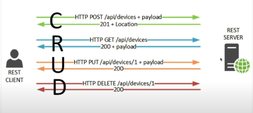

# **MERN Stack - Support ticket application.**

## Video 1 
- Built rest api with express (which is backend nodejs framework).
- MognoDB for database and mongoose for connect and interaction with mongodb.
## Video 2
- Adding Authentication in api then we can create login endpoint and register endpoint.
- Then we will able to get json web token once we authenticate.
- With that token we can able to access protected routes.
## Video 3; we will start on front-end.
- Start on front-end we have user form, login form and dashboard {where we have goals}.
- REST api gonna Create, Read, Update and Delete.  
- We gonna use redux on front-end.
//the main resource in this gonna be goals and theres were rest api gonna be we gonna create, read, update and delete goals.

## 1. What is REST api and how it works?



1. Restclient(react app)  -------- Restserver(express frame,*apis*).
- we need these two to communicate - and we do that with REST api.
- that is done using bunch of HTTP request and the operation we gonna do with HTTP is CRUD= create, read, update and delete.


C ------>http POST /api/goals + payloads-------->
         create goals (goal is resource)
<-------------201+location---------------------
   everything went ok and something was created.

R ------------>http GET /api/goals-------------->
                  read goals
<----------------200+payloads------------------
            everything is ok and data

U ------>http PUT /api/goals/1 + payloads-------->
update goals, include id to tell which goals you want to update
<--------------------200------------------------
                 everything is ok

D ----------->http DELETE /api/goals/1----------->
            Delete goals with id of goals
<--------------------200------------------------
                 everything is ok


**Our Goal is to create this same API shown above for our Goals**


## 2. Complete Requirments.

1. postman - for http client
2. mongodb atlas cloud - using for database on cloud.


## 3. Get API up & running and create our routes.

### 1. Setup server up & running

1. Created backend_folder in root_folder > where our Routes, Models and Controllers goes in that folder.

2. Created Server.js file in backend_folder, which is entry point to our server.

3. In root folder our all backend's dependencies gonna go.

4. Run "npm init" in root_folder.
- DO "entry point: (index.js) server.js"

5. created .gitignore in root_folder. add "node_module" and ".env" which will ignore the from push to git.

6. run "npm i express dotenv mongoose colors"

7. run "npm i -D nodemon" for dev dependencies. good during development.

8. In package.json > we gobnna add script "start" into script heading. and we want "node backend/server.js" to run with "start".
   In "Script":
   "start": "node backend/server.js",
   "server": "nodemon backend/server.js"

9. Go to /backend/server.js

10. Run "npm run server" 


### 2. Create a Route.

#### 1. Creating Route (basic way)

1. Open postman > close all tabs and click on + > select any method you want to use.

2. We will use GET method in postman and input URL "http://localhost:5000/api/goals" > send (this will get our goals from our database).

3. In response we get 404 Not Found page with html page.

4. Edit Backend/server.js create method & route for goals.

```javascript
app.get("/api/goals",function(req,res){
   //res.send("Get goals") //not preferred
   //OR
   //res.json({message: "Get goals"}) // Usualy response we send is in JSON, status we get 200.
   //OR
   res.status(200).json({message: "Get goals"})
})
```

#### 1. Creating Route (proper way)

1. Create Route_folder > in it create goalroutes.js

2. In goalroutes.

```javascript
router.get("/",function(req,res){ //we made "/" because location is already specified in server.js
    res.status(200).json({message: "Get goals"})
})
```
3. Replace previous code in server.js of app.get with

```javascript
app.use("/api/goals",require("./Routes/goalroutes"))
```

**we could add our functionality in the body these routers, but it is good practice to make controllers**


### 3. Create a controllers.

1. Create controllers_folder > in it create goalcontroller.js

2. Checkout in file.


### 4. Middleware (Accepting body data, Error handling)

*before connecting to database we have to setup error handling*

#### 1. Accepting body error

1. In postman > we open POST request > we need to send data in body to create goals.

2. In postman > open POST > in body >x-www-form-urlencoded {key: value} > add data into it > send.
RES > {"message": "created your goals"} (nothing happenned by sending body message, old msg rec).
*becuase we haven't handled it yet.*

3. In Controller in post bracket i did > console.logs(req.body) > but it will not show message of requested body. 
*because we need to add midleware in order to use body data*

4. In Server.js >
app.use(express.json()) // for body parser
app.use(express.urlencoded({extended:true})) // for url encoded // and parse object with extended false.

#### 2. Error handling

1. Express js has built-in error handling but >in response it show html messages too. > now we will change the default html of error handling.

2. To do that we need to add middleware function & to do that we need to create folder and files.

3. middleware function execute during the response and request cycle.

4. Created middleware_folder > then created errorMidlewar.js > add function to it and overrite that function. (to change nodejs default error page)

### 5. Mongoose

1. when we use mongoose in all function in goalcontroller file to interact with database we gonna get back a promise > so we gonna use async.

2. install "npm i express-async-handler" and add "const asyncHandler = require("express-async-handler")" inside goalcontroller.

### 6. MongoDB (Database)

1. Open website of mongoDB > go to mongodbatlas and signup.

2. Choose free plan and setup cluster name > make new project or remain in current project > create username and password in that project > create database and collection like goals or username.

3. to start prcoess of connect in application first enter > run commnd "npm install mongodb" > (to connect) add Add your connection string in your code (like i did in .env file).

4. we have created db.js (file to connect with database) and goalmodel.js (file to create schema like what type of field will present in data.)

5. use goalmodel module in goalcontroller.js.


# Things i want to remember.(IGNORE)

1. function inside parameter.

```javascript
(xyz,function(x,y){
   xyz
})
--OR--
(xyz, (x,y)=>{
   xyz
})
```

2. Normal function.

```javascript
function xyz(x,y){
   xyz
}
--OR--
xyz=(x,y)=>{
   xyz
}
```

3. Normal object

```javascript
var xyz={
   xyz: "xyz"
   xyz: 10
}
```
