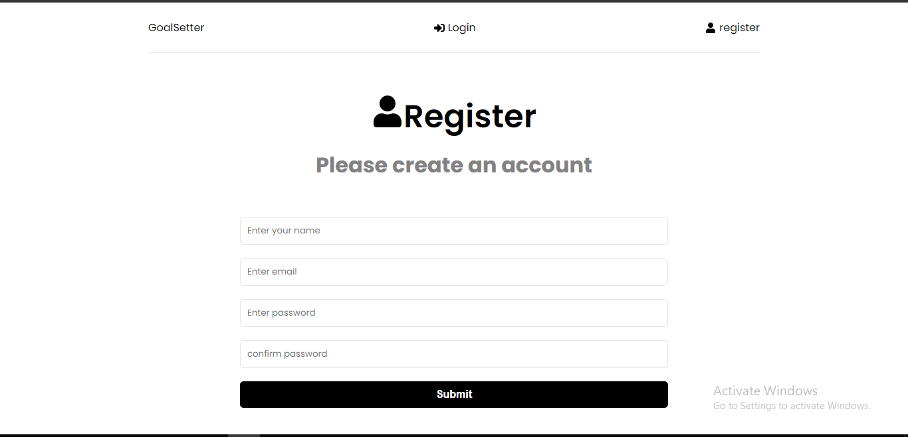
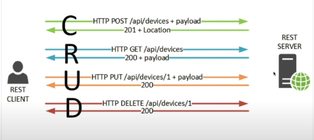

# Basic Webapp on MERN stack
**Follow steps to understand MERN stack and create fullstack webapp**

MERN= Mongodb, Express, React, Nodejs
Website = https://basic-webapp-mern.onrender.com/



## TASK 1 
- Built rest api with express (which is backend nodejs framework).
- MognoDB for database and mongoose for connect and interaction with mongodb.
## TASK 2
- Adding Authentication in REST api using JSON web token then we can create login endpoint and register endpoint.
- Then we will able to get json web token once we authenticate.
- With that token we can able to access protected routes.
## TASK 3; we will start on front-end.
- Start on front-end we have user form, login form and dashboard {where we have goals}.
- REST api gonna Create, Read, Update and Delete.  
- We gonna use redux on front-end.
//the main resource in this gonna be goals and theres were rest api gonna be we gonna create, read, update and delete goals.


# TASK 1
## 1. What is REST api and how it works?



1. Restclient(react app)  -------- Restserver(express frame,*apis*).
- we need these two to communicate - and we do that with REST api.
- that is done using bunch of HTTP request and the operation we gonna do with HTTP is CRUD= create, read, update and delete.


```javascript
C ------>http POST /api/goals + payloads-------->
         create goals (goal is resource)
<-------------201+location---------------------
   everything went ok and something was created.


R ------------>http GET /api/goals-------------->
                  read goals
<----------------200+payloads------------------
            everything is ok and data


U ------>http PUT /api/goals/1 + payloads-------->
update goals, include id to tell which goals you want to update
<--------------------200------------------------
                 everything is ok


D ----------->http DELETE /api/goals/1----------->
            Delete goals with id of goals
<--------------------200------------------------
                 everything is ok
```


**Our Goal is to create this same API shown above for our Goals**


## 2. Complete Requirments.

1. postman - for http client
2. mongodb atlas cloud - using for database on cloud.


## 3. Get API up & running and create our routes.

### 1. Setup server up & running

1. Created backend_folder in root_folder > where our Routes, Models and Controllers goes in that folder.

2. Created Server.js file in backend_folder, which is entry point to our server.

3. In root folder our all backend's dependencies gonna go.

4. Run "npm init" in root_folder.
- DO "entry point: (index.js) server.js"

5. created .gitignore in root_folder. add "node_module" and ".env" which will ignore the from push to git.

6. run "npm i express dotenv mongoose colors"

7. run "npm i -D nodemon" for dev dependencies. good during development.

8. In package.json > we gobnna add script "start" into script heading. and we want "node backend/server.js" to run with "start".
   In "Script":
   "start": "node backend/server.js",
   "server": "nodemon backend/server.js"

9. Go to /backend/server.js

10. Run "npm run server" 


### 2. Create a Route.

#### 1. Creating Route (basic way)

1. Open postman > close all tabs and click on + > select any method you want to use.

2. We will use GET method in postman and input URL "http://localhost:5000/api/goals" > send (this will get our goals from our database).

3. In response we get 404 Not Found page with html page.

4. Edit Backend/server.js create method & route for goals.

```javascript
app.get("/api/goals",function(req,res){
   //res.send("Get goals") //not preferred
   //OR
   //res.json({message: "Get goals"}) // Usualy response we send is in JSON, status we get 200.
   //OR
   res.status(200).json({message: "Get goals"})
})
```

#### 1. Creating Route (proper way)

1. Create Route_folder > in it create goalroutes.js

2. In goalroutes.

```javascript
router.get("/",function(req,res){ //we made "/" because location is already specified in server.js
    res.status(200).json({message: "Get goals"})
})
```
3. Replace previous code in server.js of app.get with

```javascript
app.use("/api/goals",require("./Routes/goalroutes"))
```

**we could add our functionality in the body these routers, but it is good practice to make controllers**


### 3. Create a controllers.

1. Create controllers_folder > in it create goalcontroller.js

2. Checkout in file.


### 4. Middleware (Accepting body data, Error handling)

*before connecting to database we have to setup error handling*

#### 1. Accepting body error

1. In postman > we open POST request > we need to send data in body to create goals.

2. In postman > open POST > in body >x-www-form-urlencoded {key: value} > add data into it > send.
RES > {"message": "created your goals"} (nothing happenned by sending body message, old msg rec).
*becuase we haven't handled it yet.*

3. In Controller in post bracket i did > console.logs(req.body) > but it will not show message of requested body. 
*because we need to add midleware in order to use body data*

4. In Server.js >
app.use(express.json()) // for body parser
app.use(express.urlencoded({extended:true})) // for url encoded // and parse object with extended false.

#### 2. Error handling

1. Express js has built-in error handling but >in response it show html messages too. > now we will change the default html of error handling.

2. To do that we need to add middleware function & to do that we need to create folder and files.

3. middleware function execute during the response and request cycle.

4. Created middleware_folder > then created errorMidlewar.js > add function to it and overrite that function. (to change nodejs default error page)

### 5. Mongoose

1. when we use mongoose in all function in goalcontroller file to interact with database we gonna get back a promise > so we gonna use async.

2. install "npm i express-async-handler" and add "const asyncHandler = require("express-async-handler")" inside goalcontroller.

### 6. MongoDB (Database)

1. Open website of mongoDB > go to mongodbatlas and signup.

2. Choose free plan and setup cluster name > make new project or remain in current project > create username and password in that project > create database and collection like goals or username.

3. to start prcoess of connect in application first enter > run commnd "npm install mongodb" > (to connect) add Add your connection string in your code (like i did in .env file).

4. we have created db.js (file to connect with database) and goalmodel.js (file to create schema like what type of field will present in data.)

5. use goalmodel module in goalcontroller.js.


# TASK 2
*Old Task= we created REST api which is CRED api, we can create, read, update and delete goals*
*In this Task= we gonna add authentication so just not anybody can create, read, update, and delete goals*

## 4. What is JSON Web Token (JWT)?

Token has 3 Parts.
1 Part is Header= which include Algorithum and Token type.
```json
{
   "alg": "HS256",
   "typ": "JWT"
}
```
2 Part is Data= which include data that is our user ID.
```json
{
   "sub": "123456789",
   "name": "soham sharma",
   "int": 123456123 //it also has time_stamp the token was issue at.
}
```
3 Part is Signature= which will ensure that JWT hasn't been altered in any way.

*the private key known only to the issuer*
*party that creates the token, assigns the header and paylod with secret that know to the issuer and reciver*

### how to protect route that we gonna access?
login > get the token > send token in the headers to access that protected route.

## 5. Add User to goal model.

1. Create usermodel.js in models_folder > uase mongoose to create schema.

2. Use usermodel.js refrence in goalmodels.js.

## 6. User route and conroller function.

1. Add API of user in server.js [app.use] > create userroute.js to manage that request [app.get, app.post, app.put, app.delete] > attach that api to userroute.js.

2. Make usercontrol.js for userroute.js (usercontroller.js will take action on userroute.js method of request is made)

3. Install "npm i bcryptjs" for pass encryptionand and "npm i jsonwebtoken" because we will dealing with json web token. > add those both [bcrypt and jsonwebtoken] modules to usercontroller.js. and add user from = usermodel.js to userconroller.js.

4. In usercontroller.js created function for action [register, login and getting data of user] and in them added hash password with salt, authentication and JSON webtokens respectively.

5. Created authmiddleware.js and use module in userroutes.js and goalroutes.js.


# TASK 3
*we gonna use redux along with redux toolkit*

## 7. Generate our REACT application.

**React is a JavaScript library for building user interfaces.**

**Note= Every work gonna be done in frontend folder**

1. First install the package "npm install create-react-app" (by running this command i make available create-react-app to this system by which i can create react projects)

2. Generate our react application > in Frontend_folder "npx create-react-app frontend --template redux" or "npx create-react-app@latest frontend --template redux" (npx to run executables from packages) > the frontend_folder will get created.

*"--template redux"= it will install redux toolkit and react redux package*

3. Let run react-dev server but it is in frontend folder, for simplicity let us add script in backend json > go to package.json of backend > add in script "Client": "npm start --prefix frontend".

4. Run on frontend > "npm run client", right now we just don't need backend to run, in future i'll show you to run both backend and frontend with one script.

5. Created 3 pages > in pages_folder in frontend > as dashboard.jsx, login.jsx and register.jsx.

6. Now want route to thiese 3 pages for that install package > go to frontend folder first "cd frontend" then > run "npm i react-router-dom".

7. Add that three pages in app.js by importing module.

8. Creates header.jsx in feature_folder so that we can create some navigations in header.

9. Run on frontend > "npm i react-icons" to use some icons in header.jsx/features.

10. create good register form & login form in regiter.jsx & login.jsx situated in pages_folder in frontend.

11. Now to run Backend and Frontend at same time than run > "npm i -D concurrent" > go to root package.json add into script "dev": "concurrently \"npm run server\" \"npm run client\"" > now you can run both backend and frontend by "npm run dev".

12. **after run "npm run dev" > our both Backend and Frontend running check in terminal > server start on port 5000 & frontend start on port 3000**

13. In frontend create auth_folder in features & create authSlice.js and authService.js in it.

14. Now create registration with athunk function in authslice.jsx.
*athunk function = this function will deal with async data and backend*

15. install "npm i axios react-toastify", toastify will show alerts. > go to authservice.js and create http requests with axios from which you will send register request to backend from frontend and connect them.

16. add proxy in frontend package.json to connect backend and frontend > below "version" add > "proxy": "http://localhost:5000"

17. connnect register & reset function of authSlice.jsx with register.jsx.

18. load your application and input values in register it will save to database.


-
-
-
-
-
-
-
-
-
-
-
-
-
-
-
-
-
-
-
-
-


## 1. Github Actions 

## 1. What is Github actions?
## 2. How to use Github actions - step by step DEMO.
## 3. Github action terms: Events, Workflows, Jobs, Steps.

1. **Github actions**= built-in feature in Github to create custom automated workflows like CI/CD|DevOps.
   what is workflows?
   - like in jenkins (it is CI tool) = in which we create automated jobs. build job, testing job, release job, we share link of github when ever we update repo this job will run. but in github actions we can do this thing within githubs.
      - Implement CI/CD | Devops workflows.
      - we can also create to automate other workflows like SDLC = by this we can perform any action or events automatically on commit.
      - we can run the task on specific events.

```markdown
                               stages in software development
         code         >       Build       >       Deploy      >       Testing        >        Release
   developement team   "npm run build" than
put code on github     it creates a build
                       folder (static files)
                       than u gonna run static
                       application from there.
 ```

2. **DEMO** 
Step 1 - Sign up or login to Github.com.
Step 2 - Create a new repo or use in existing repo.
Step 3 - In the repo > create folder .github/workflows by going to repo and actions tab > select create       
         yourself and .github/workflows/main.yml create automatically.
Step 4 - Yaml file with .yml extension are those in which we create these workflows.
Step 5 - Add the workflow content in the main.yml file.
```json
// Example of simple workflow.
name: hello-world // name of workflow
on: push // Event = when push occcur than run jobs
jobs:
  my-job:  // one job under jobs
    runs-on: ubuntu-latest // job = run commands on this machine, so job setting up this machine.
    steps: // step = perform actual command
      - name: my-step  
        run: echo "Hello World!" // in step command is running.
```
Step 6 - Commit and push the changes.
Step 7 - Check Actions and you will see jobs that run, you can click on it to know more.

3. **Terms**=
   WORKFLOW- collection of jobs, defined in yaml files [name:]
   EVENTS- any activity in the workflow that triggers the workflow [on:]
   JOBS- collection of steps. [jobs:] we can create many sub jobs under this by [my-jobs:]
   STEPS- actual action to be taken = commands, scripts. [steps:]


## 2. Automatically [Build & Test & Deploy] om RENDER.

1. Go to webserver service in Render.

2. Connect to github and Get repo project from your github account.

3. Pre-deploy commands.
-> Run "npm install --prefix frontend" which install dependencies in frontend folder and 
-> Run "npm run build --prefix frontend" which will create build folder in frontend folder.
-> Run "npm install" which install dependencies for backend folder.

4. deploy commands.
-> Run "npm run start" which is "node backend/server.js" which will start webserver.

5. After deploy It will create link and go to link of render like https://your_project.onrender.com/.

6. When you commit it will deploy automatically again with new changes.


## 3. Automatic [Build & Test & Deploy] using Github actions.
**Github pages only runs static webpages not dynamic webpages**

STATIC PART = Frontend on Github-pages

1. with "npm run dev" > we running backend dev "npm run server" & frontend dev "react-scripts start" that we get with react app.

2. well frontend dev server is not in production and backend has production.

3. when we do "npm run build" in frontend it will create Build folder > which have static pages including index.html pages so we have to add this to server.js file.

4. add code to server.js of frontend build folder.

5. install "npm install --save gh-pages" in root package.json, which enables github pages on app.

6. add in root package.json.
"homepage": "https://myusername.github.io/my-app" after main section.
"predeploy": "npm run build" in script section.
"deploy": "gh-pages -d build" in script section.

7. go to github/setting/tokens > generate token to deploy application through workflow. > add that token to project/settings/secret with name of var ACTIONS_DEPLOY_ACCESS_TOKEN.

DYNAMIC PART = Backend on RENDER

1. create account on render.

2. Use web services > 
-
-
-
-
-
-
-
-
-
-
-
-
-
-
-
-
-
-
-
-
-

# Things i want to remember.[IGNORE]

**javascript vs es6**
t's important to clarify that ES6 (ECMAScript 2015) is not a different language from JavaScript. Instead, ES6 is a significant update to the JavaScript language specification, introducing new features, syntax enhancements, and improvements to the language. ES6 is sometimes referred to as ECMAScript 2015 or ECMAScript 6, but it's commonly called ES6 for brevity.

**Javascript** = it didn't have block-scoped variables (let and const), arrow functions, classes, and destructuring.
**ECMAscript 6/2015** = Some of the key features introduced in ES6 include:
   - Block-scoped variables: `let` and `const` for declaring variables with block scope.
     Example:-
      ```javascript
      function exampleFunction() {
         if (true) {
            let blockScopedVar = "I am block-scoped!";
            const constantVar = "I won't change!";
         }
         // `blockScopedVar` and `constantVar` are not accessible here
      } 
      ``` 
   - Arrow functions: A more concise syntax for defining functions.
   - Classes: A more structured and object-oriented way to create constructor functions.
   - Destructuring: A way to extract values from objects and arrays more easily.
   - Template literals: A way to create string literals with embedded expressions.
   - Default function parameters and rest parameters.
   - Modules: A standardized way to organize and import/export code.
   - Promises: A mechanism for handling asynchronous operations more cleanly.
   - ...and more.


---------------------------------------------------------------------------------------------------------------

**javascript famous libraries and framework**

1. **Front-End Web Development:**
   - **React.js:** A library for building user interfaces, developed by Facebook. It is often considered a framework by virtue of its ecosystem and capabilities.
   - **Angular:** A full-featured framework for building web applications, developed by Google.
   - **Vue.js:** A progressive framework for building user interfaces.
   - **jQuery:** A library for simplifying HTML document traversal and manipulation, as well as event handling.
   - **D3.js:** A library for data visualization using HTML, SVG, and CSS.

2. **Back-End Development:**
   - **Node.js:** While not a traditional framework, Node.js is a runtime environment that allows you to build server-side applications with JavaScript. You can use frameworks for web server development like:-
      - Express.js.
      - Nest.js.
      - Hapi.js.

3. **Server-Side Development:**
   - **Express.js:** A minimal and flexible Node.js web server development framework.
   - **Koa.js:** A modern and lightweight Node.js web framework.

4. **Full-Stack Development:**
   - **Meteor:** A full-stack platform for building web and mobile applications using a single codebase.

5. **Real-Time Web Applications:**
   - **Socket.IO:** A library and framework for building real-time web applications with features like WebSocket support.

6. **State Management:**
   - **Redux:** A predictable state container for managing the state of JavaScript applications.
   - **Mobx:** A simple and scalable state management library.
   - **Vuex:** The state management library for Vue.js applications.


7. **HTTP Requests:**
   - **Axios:** A popular library for making HTTP requests from the browser or Node.js.

8. **Utility Libraries:**
   - **Lodash:** A utility library that provides many helpful functions for common programming tasks.
   - **Underscore.js:** A similar utility library with functional programming features.

9. **Testing:**
   - **Jest:** A JavaScript testing framework often used with React applications.
   - **Mocha:** A flexible testing framework that works well for both browser and Node.js environments.

10. **Routing:**
   - **React Router:** A popular library for handling client-side routing in React applications.
   - **Vue Router:** The official router for Vue.js applications.
   - **React Navigation:** A routing and navigation library for React Native applications.

11. **Date and Time:**
   - **Moment.js:** A library for parsing, validating, manipulating, and formatting dates and times.
   - **date-fns:** A modern JavaScript date utility library.

12. **Animation:**
   - **GreenSock Animation Platform (GSAP):** A robust animation library for creating high-performance animations in web applications.

13. **UI Component Libraries:**
   - **Material-UI:** A popular UI framework for React applications following the Material Design guidelines.
   - **Ant Design:** A comprehensive UI library for building enterprise-level web applications.
   - **Vuetify:** A Material Design component framework for Vue.js.

14. **Mobile Development:**
   - **React Native:** A framework for building mobile applications using React.
   - **Ionic:** A framework for building mobile and progressive web apps using web technologies.

15. **Data Visualization:**
   - **Chart.js:** A simple and flexible JavaScript charting library.
   - **Plotly:** A graphing library that makes interactive, publication-quality graphs online.

16.  **Machine Learning and Data Science:**
   - **TensorFlow.js:** A library for machine learning and deep learning in JavaScript, which can run in both the browser and Node.js.

17. **Serverless Computing:**
   - **AWS Amplify:** A framework for building serverless applications using JavaScript and AWS services.
   - **Serverless Framework:** While not JavaScript-specific, it allows you to develop, deploy, and manage serverless applications with support for JavaScript-based functions.


---------------------------------------------------------------------------------------------------------------

1. function inside parameter.

```javascript
(xyz,function(x,y){
   xyz
})
--OR--
(xyz, (x,y)=>{
   xyz
})
```

2. Normal function.

```javascript
function xyz(x,y){
   xyz
}
--OR--
xyz=(x,y)=>{
   xyz
}
```

3. Normal object

```javascript
var xyz={
   xyz: "xyz"
   xyz: 10
}
```
